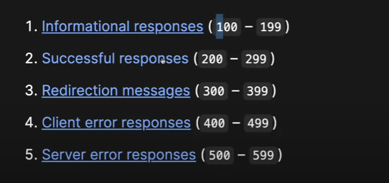

# middle Ware

- middle ware is something like that will be like middle person between server and client.
- this check or perform any operations on req before sending to server. If it is anything illegal, invalid or threat we can send response before it get the access of the server.
- there can be multiple middle wares.
- we can add our custom middle ware by app.use()
- it take callback function as input (req, res, next)
- next is function which points to next middle ware on sequence if not there it will points to route.

